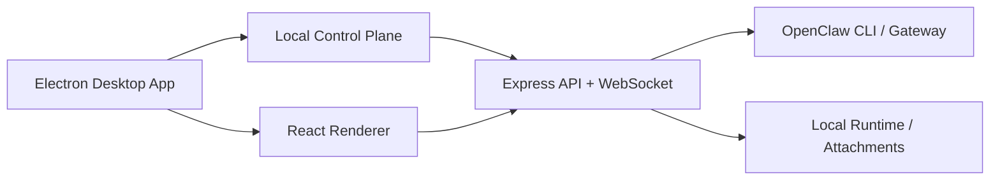

# OpenClaw Agent Team Control

[English](./README.md) | [简体中文](./README.zh-CN.md)

OpenClaw Agent Team Control is a macOS desktop console for operating a local OpenClaw agent swarm. It wraps a local control plane, real-time status collection, agent chat, attachment handling, and a cluster management view into a single Electron app.

## What it does

- Desktop-first control surface for local OpenClaw workflows
- Home view for direct agent chat with model switching, attachments, history, and timezone-aware clock
- Cluster view for topology, tasks, sessions, nodes, events, and agent inspector panels
- Real data mode backed by local `openclaw` CLI detection and polling
- Mock fallback mode so the UI can still open when OpenClaw is unavailable
- One-click OpenClaw bootstrap entry with dependency checks and base setup
- macOS packaging via Electron Builder

## Architecture



## Main capabilities

- Agent conversation workspace
  - Select an agent and send commands directly
  - Attach local files
  - Preview images, text, PDF, audio, video, and generic files in chat
  - Load conversation history and recent tool-call context
- Swarm management
  - Visual topology for gateway, nodes, and agents
  - Task and workflow status
  - Node health and runtime metrics
  - Recent event stream
- Desktop operations
  - Auto-start local backend when the Electron app launches
  - Package into `.app`, `.dmg`, and `.zip`
  - Local OpenClaw deployment helper in the sidebar

## Project structure

```text
electron/          Electron main process
server/            Local control plane and OpenClaw providers
src/               React desktop UI
build/             Build resources, icons, wallpapers
docs/              Deployment notes
scripts/           Utility scripts
```

## Requirements

- macOS
- Node.js 20+
- npm
- Optional but recommended: local `openclaw` installation and running Gateway

## Quick start

```bash
cd /Users/apple/Documents/New\ project
npm install
npm run desktop:dev
```

For a production-style desktop run:

```bash
cd /Users/apple/Documents/New\ project
npm run desktop
```

## Build the desktop app

```bash
cd /Users/apple/Documents/New\ project
npm run dist:mac
```

Build output is written to:

- `release/*.dmg`
- `release/*.zip`
- `release/mac-arm64/*.app`

## Data source behavior

The local control plane uses `OPENCLAW_CLUSTER_SOURCE=auto` by default.

- `real`: use local OpenClaw data
- `mock`: use built-in demo data
- `auto`: prefer real data and fall back to mock when unavailable

Examples:

```bash
OPENCLAW_CLUSTER_SOURCE=real npm start
OPENCLAW_CLUSTER_SOURCE=mock npm start
```

## Notes for GitHub

- This project is tuned for local macOS usage.
- The packaged macOS build is currently unsigned.
- On first launch, macOS may require opening the app via right click -> `Open`.
- If you plan to publish releases, add your own code signing and notarization flow.

## Related docs

- [macOS desktop run](./docs/desktop-macos.md)
- [Local deployment notes](./docs/deploy-macos.md)
- [GitHub release guide](./docs/github-release.md)
- [Repository publish checklist](./docs/repo-publish-checklist.md)
- [Release notes for v1.0.0](./docs/release-v1.0.0.md)
- [Changelog](./CHANGELOG.md)
- [License](./LICENSE)
