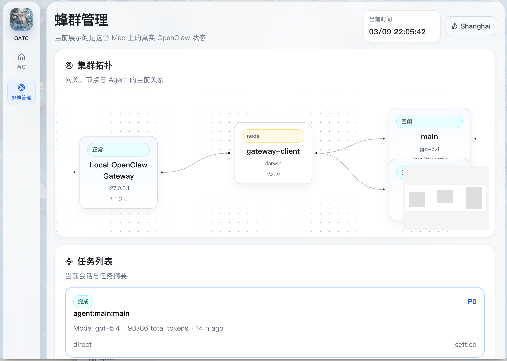
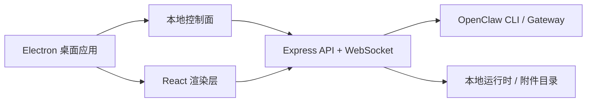

# OpenClaw Agent Team Control

[English](./README.md) | [简体中文](./README.zh-CN.md)

OpenClaw Agent Team Control 是一个面向 macOS 的 OpenClaw 多 Agent 桌面控制台。它把本地控制面、实时状态采集、Agent 对话、附件处理和蜂群管理界面整合到一个 Electron 应用里。

## 项目特性

- 面向桌面端的 OpenClaw 本地控制台
- 首页支持直接和 Agent 对话，包含模型切换、附件、历史记录和时区时间
- 蜂群管理页支持查看拓扑、任务、会话、节点、事件和 Agent 详情
- 优先接入本机 `openclaw` CLI 和 Gateway 的真实数据
- OpenClaw 不可用时自动回退到 mock 数据，方便演示和本地开发
- 侧边栏内置一键 OpenClaw 基础部署入口
- 支持通过 Electron Builder 打包成 macOS 安装包

## 界面截图

### 首页对话工作区


### 蜂群管理界面



## 架构概览



## 核心能力

- Agent 对话工作区
  - 选择 Agent 直接下发命令
  - 支持本地附件上传
  - 支持图片、文本、PDF、音频、视频和普通文件卡片预览
  - 支持查看对话历史和最近 Tool Call 上下文
- 蜂群管理
  - 展示网关、节点和 Agent 拓扑
  - 展示任务和流程状态
  - 展示节点健康度和运行指标
  - 展示最近事件流
- 桌面端运维
  - Electron 启动时自动拉起本地后端
  - 可打包成 `.app`、`.dmg`、`.zip`
  - 侧边栏提供 OpenClaw 部署助手

## 目录结构

```text
electron/          Electron 主进程
server/            本地控制面与 OpenClaw provider
src/               React 桌面端界面
build/             图标和壁纸等构建资源
docs/              部署和发布文档
scripts/           工具脚本
```

## 环境要求

- macOS
- Node.js 20+
- npm
- 可选但推荐：本机已安装 `openclaw`，并有可用 Gateway

## 快速启动

```bash
cd /Users/apple/Documents/New\ project
npm install
npm run desktop:dev
```

如果你要跑接近正式使用的桌面版：

```bash
cd /Users/apple/Documents/New\ project
npm run desktop
```

## 打包桌面端

```bash
cd /Users/apple/Documents/New\ project
npm run dist:mac
```

打包产物会输出到：

- `release/*.dmg`
- `release/*.zip`
- `release/mac-arm64/*.app`

## 数据源模式

本地控制面默认使用 `OPENCLAW_CLUSTER_SOURCE=auto`。

- `real`：使用本机 OpenClaw 真实数据
- `mock`：使用内置演示数据
- `auto`：优先真实数据，不可用时自动回退

示例：

```bash
OPENCLAW_CLUSTER_SOURCE=real npm start
OPENCLAW_CLUSTER_SOURCE=mock npm start
```

## GitHub 发布说明

- 这个项目当前主要面向本地 macOS 使用
- 打包出的 macOS 应用目前是未签名版本
- 第一次打开时，macOS 可能需要右键应用后选择“打开”
- 如果后续要公开发布，建议补代码签名和 notarization 流程

## 相关文档

- [macOS 桌面端运行说明](./docs/desktop-macos.md)
- [本地部署说明](./docs/deploy-macos.md)
- [GitHub Release 发布指南](./docs/github-release.md)
- [仓库公开检查清单](./docs/repo-publish-checklist.md)
- [v1.0.0 Release 文案](./docs/release-v1.0.0.md)
- [变更记录](./CHANGELOG.md)
- [许可证](./LICENSE)
